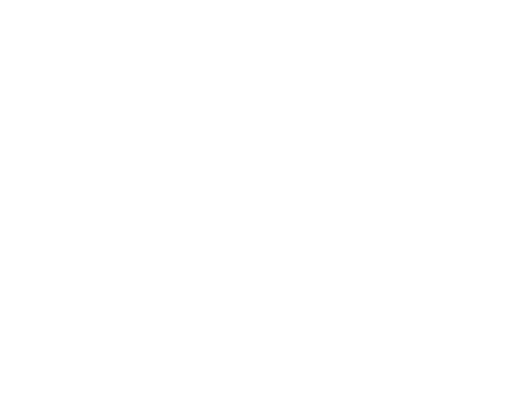

### **Propósito**

El presente documento tiene como finalidad comunicar los conceptos fundamentales del proyecto, identificando los problemas existentes, los actores involucrados, las necesidades detectadas y la solución tecnológica propuesta.

### **Alcance**

El sistema está destinado a la **administración integral de la logística y reparación** de los vehículos pertenecientes a la flota empresarial, abarcando desde la recepción del vehículo hasta el control de stock de repuestos y la generación de informes técnicos.

### **Definiciones y Abreviaciones**

- **Mantenimiento:** Conjunto de actividades destinadas a conservar los vehículos en condiciones óptimas de funcionamiento.
- **Mantenimiento Correctivo:** Reparaciones realizadas como consecuencia de averías o fallas detectadas.
- **Mantenimiento Programado:** Actividades planificadas con carácter preventivo para evitar fallas futuras.
- **NRep:** Número de Reparación único asignado a cada solicitud de mantenimiento o reparación.

---

## **Orientación**

### **Descripción del Problema**

Actualmente, la gestión de mantenimiento de la flota carece de un sistema centralizado, dependiendo del uso de planillas manuales y registros dispersos. Esta situación genera pérdida de eficiencia, falta de trazabilidad y dificultades para mantener un control actualizado del inventario.

**Afecta a:**

- Personal de taller
- Mecánicos
- Personal de inventario
- Choferes

**Solución propuesta:**  
Implementar un **sistema integrado de gestión de mantenimiento**, con una base de datos centralizada y automatización de los procesos de solicitud, aprobación y control de repuestos.

**Impacto esperado:**

- Reducción de tiempos administrativos.
- Control eficiente de inventario.
- Trazabilidad completa de las reparaciones.
- Mejora en la comunicación interna y coordinación operativa.

---

## **Stakeholders**

### **Personal No Usuario**

- **Analista de Sistemas:** Encargado del análisis funcional y diseño del sistema.
- **Programador:** Responsable del desarrollo, implementación y pruebas del software.

### **Usuarios del Sistema**

- **Personal de Taller:** Registra datos de mantenimiento y avances en las reparaciones.
- Personal de Inventario:** Administra el stock y genera alertas por faltantes.
- **Jefe de Taller:** Supervisa los procesos, aprueba solicitudes y controla la calidad del servicio.

---

## **Visión General del Producto**

El sistema se organiza en subsistemas especializados que trabajan de manera integrada para garantizar la eficiencia operativa y la trazabilidad de las actividades:

- **Gestión de Sesiones:** Control de autenticación, perfiles y permisos de usuario.
- **Generación de Informes:** Elaboración y almacenamiento de solicitudes e informes técnicos.
- **Control de Solicitudes:** Registro, aprobación y seguimiento de solicitudes de repuestos y reparaciones.

## **Diagrama de Flujo de Datos**

## **Características Principales**

- Control automatizado del stock de repuestos.
- Seguimiento integral de las reparaciones de la flota.
- Generación automática de alertas y solicitudes de compra.
- Registro centralizado de operaciones y reportes técnicos.