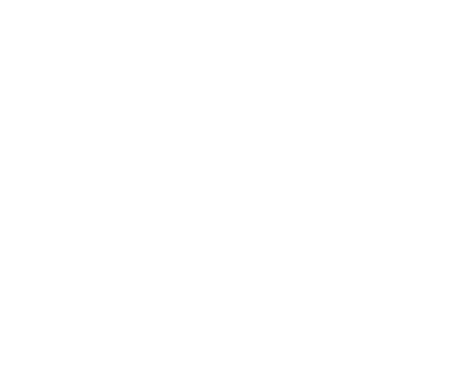

```plantuml
@startuml
skinparam backgroundColor transparent
skinparam usecase {
  BackgroundColor transparent
  BorderColor white
  FontColor white
}
skinparam actor {
  BackgroundColor transparent
  BorderColor white
  FontColor white
}
skinparam rectangle {
  BackgroundColor transparent
  BorderColor white
  FontColor white
}
skinparam ArrowColor white
skinparam Shadowing false
skinparam DefaultFontColor white

left to right direction

actor "Chofer" as chofer
actor "Jefe de Taller" as jefe
actor "Mecánico" as mecanico
actor "Personal de Inventario" as inventario

rectangle "Sistema de Gestión de Taller" {
  usecase "CU1 - Entrega de Vehículo" as CU1
  usecase "CU2 - Solicitar Repuestos" as CU2
  usecase "CU3 - Actualizar Estado de Reparación" as CU3
  usecase "CU4 - Ingresar Nuevo Repuesto" as CU4
}

chofer --> CU1
mecanico --> CU2
mecanico --> CU3
inventario --> CU4
jefe --> CU2
jefe --> CU3

@enduml

```
